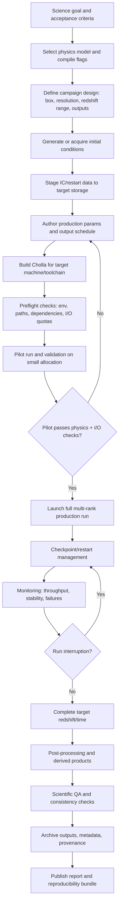

# Full Production Cosmology End-to-End Diagram (Target)

Scope: This is the full workflow needed for real science production runs. It includes what Tier 1 Step 1 already covers and what is still missing.

## Coverage status relative to Tier 1 Step 1
- Covered now:
  - Fresh runtime execution path
  - Cosmology binary build
  - Single-rank smoke run
  - Output validation and fail-on-deletion check
  - Manifest/schema/env artifact capture
  - Reproducibility check for unchanged smoke inputs
- Not covered yet:
  - Large IC generation/staging workflow
  - Multi-rank (`mpirun`) decomposition and scaling
  - Scheduler integration (SLURM/PBS) and walltime strategy
  - Long-run checkpoint/restart operations
  - Performance tuning and cost modeling
  - Production-scale QA metrics and science sign-off pipeline
  - Long-term archiving and dataset publication procedures

## Practical interpretation
Tier 1 Step 1 validates the smoke execution backbone. It should be treated as the reliability foundation for the production pipeline, not the production pipeline itself.
