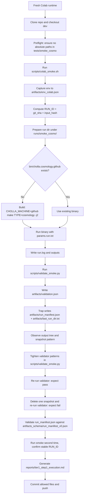

# Tier 1 Smoke End-to-End Diagram (Current, Implemented)

Scope: This is the end-to-end flow that Tier 1 Step 1 currently proves for a single-rank cosmology smoke run.

## Proven outputs and gates
- Binary: `bin/cholla.cosmology.github`
- Run directory: `runs/smoke_cosmo/<RUN_ID>/`
- Snapshots: `**/*.h5.*` (example includes `0/0.h5.0`, `0/0_gravity.h5.0`, `0/0_particles.h5.0`)
- Hard-gate artifacts:
  - `artifacts/env_colab.json`
  - `artifacts/run_manifest.json`
  - `artifacts/validation.json`
- Quality gates:
  - validator pass on intact run
  - validator fail after deleting required snapshot
  - manifest schema valid
  - reproducible run identity for unchanged inputs

## Boundaries
- Single rank only (no `mpirun`)
- Smoke-scale problem (`8x8x8`, `tout=0.0`)
- Not a production campaign workflow
